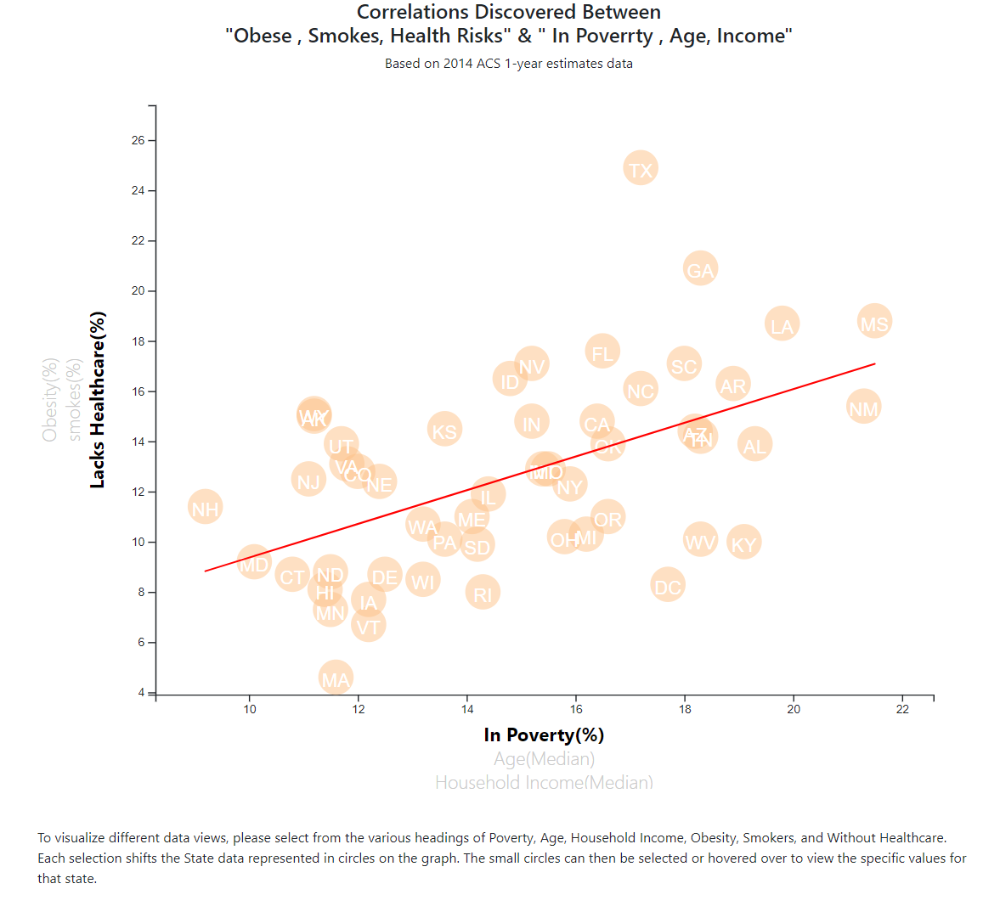
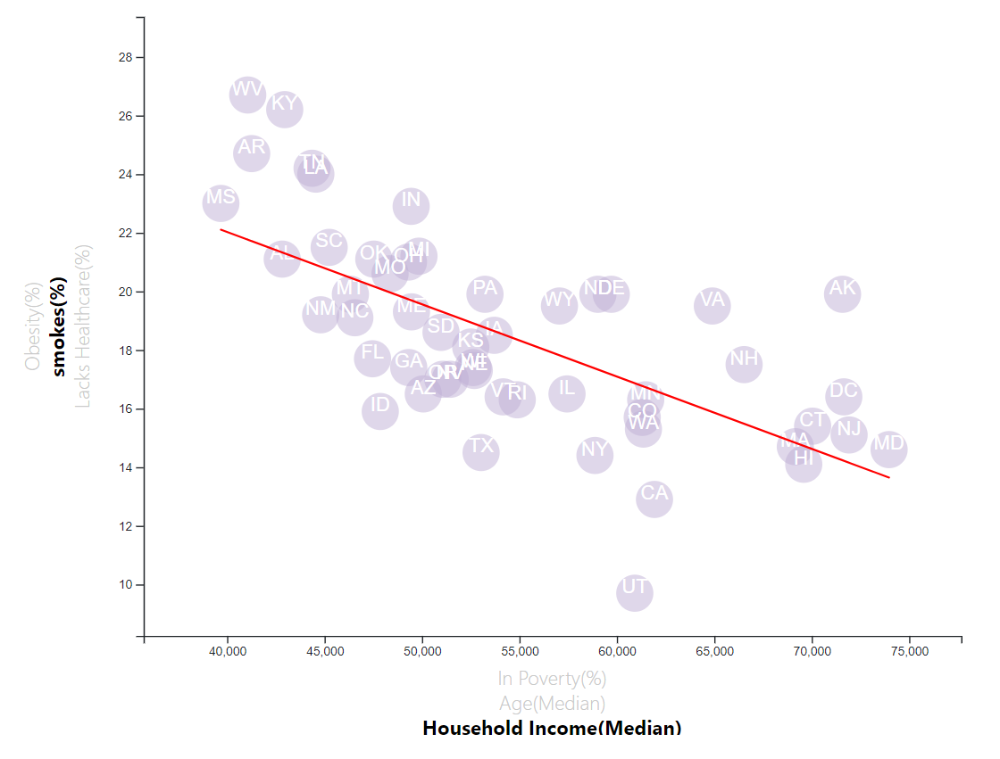

# D3 Homework - Data Journalism and D3

 

### The final project can be viewed at : https://nima-karimii.github.io/D3-challenge/

## Background

Welcome to the newsroom! I've just accepted a data visualization position for a major metro paper. I am tasked with analyzing the current trends shaping people's lives, as well as creating charts, graphs, and interactive elements to help readers understand your findings.

The editor wants to run a series of feature stories about the health risks facing particular demographics. She's counting on me to sniff out the first story idea by sifting through information from the U.S. Census Bureau and the Behavioral Risk Factor Surveillance System.

The data set included with the assignment is based on 2014 ACS 1-year estimates: [https://factfinder.census.gov/faces/nav/jsf/pages/searchresults.xhtml](https://factfinder.census.gov/faces/nav/jsf/pages/searchresults.xhtml), but I am free to investigate a different data set. The current data set includes data on rates of income, obesity, poverty, etc. by state. MOE stands for "margin of error."

## Challenge one : Plotting the scatter Plot

## Challenge two : More risk factor 

I am going to include more risk factors in scatter plot by:
* Placing additional labels and give them click events so that my users can decide which data to display. 
* Animating the transitions for  circles' locations as well as the range of axes. 

## Challenge three : Adding More demographics 

* Changing the color of plots by selecting different y_axe labels
* Adding Tooltip to circles and display each tooltip with the data that the user has selected

## Challenge four : Adding the Linear Regression 
* I put myself in more challenge to add Linear Regression on my  plots base on selected labels and animating it when the labels change by user.

### Hope you enjoy it.

